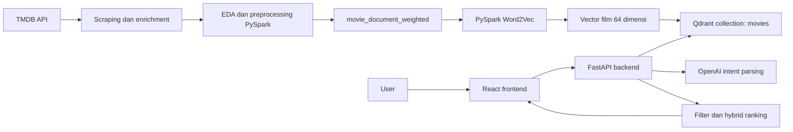

# Panduan Presentasi dan Demo CineMatch

Dokumen ini adalah pegangan untuk menjelaskan project **Movie Recommendation Big Data / CineMatch** kepada dosen. Fokus penjelasan mengikuti implementasi runtime yang benar-benar digunakan saat ini:

```text
TMDB -> PySpark preprocessing -> Word2Vec -> Qdrant -> FastAPI -> React
                                         \-> OpenAI sebagai antarmuka bahasa
```

> Catatan penting: beberapa notebook eksperimen lama masih menyebut TF-IDF sebagai model utama. TF-IDF dan CountVectorizer tetap digunakan sebagai model pembanding, tetapi model runtime aplikasi saat ini adalah **PySpark Word2Vec + Qdrant**.

---

## 1. Ringkasan 30 Detik

> CineMatch adalah sistem rekomendasi film berbasis konten. Data sekitar 80 ribu film dikumpulkan dan diperkaya dari TMDB. Metadata seperti genre, sutradara, cast, keyword, overview, dan tagline dibersihkan lalu digabung menjadi `movie_document_weighted`. PySpark Word2Vec mengubah setiap film menjadi vector 64 dimensi. Vector tersebut disimpan di Qdrant dan dibandingkan menggunakan cosine similarity. Backend kemudian melakukan hybrid re-ranking menggunakan rating, vote count, popularity, dan kualitas metadata. OpenAI hanya memahami bahasa natural dan menjelaskan hasil, sedangkan daftar film tetap ditentukan oleh model dan backend.

Kalimat utama yang perlu diingat:

> **Word2Vec membentuk representasi film, Qdrant mencari kandidat, backend menentukan ranking, dan OpenAI hanya menjadi antarmuka bahasa.**

---

## 2. Masalah dan Tujuan Project

Pencarian film biasa umumnya membutuhkan judul atau filter yang kaku. Dalam project ini, user dapat menulis permintaan natural seperti:

```text
Film seperti Interstellar
Film action dengan Christian Bale dan rating minimal 7
Film Korea setelah 2015 dengan durasi maksimal 130 menit
Film Christopher Nolan bertema perjalanan waktu
```

Sistem menyediakan dua mode rekomendasi:

1. **Similarity search**: user menyebut satu film acuan, lalu sistem mencari film yang vector-nya paling mirip.
2. **Metadata discovery**: user tidak menyebut film acuan, tetapi memberi filter seperti genre, aktor, sutradara, bahasa, rating, tahun, atau durasi.

Project menggunakan **content-based recommendation** karena dataset tidak mempunyai `user_id`, histori menonton, click history, atau rating personal yang diperlukan untuk collaborative filtering.

---

## 3. Arsitektur Sistem



### Fungsi setiap komponen

| Komponen | Fungsi |
| --- | --- |
| TMDB | Sumber data dan metadata film. |
| PySpark | Pemrosesan data dan training Word2Vec. |
| Word2Vec | Mengubah metadata film menjadi vector. |
| Qdrant | Menyimpan dan mencari vector film. |
| FastAPI | Menjalankan logika pencarian, filter, dan ranking. |
| OpenAI | Mengubah bahasa natural menjadi intent dan menjelaskan hasil. |
| React | Menampilkan chatbot dan kartu rekomendasi. |
| Docker Compose | Menjalankan service dengan environment yang konsisten. |

---

## 4. Alur Data dari Awal

### 4.1 Scraping TMDB

Data awal diambil dari TMDB melalui endpoint `discover/movie`. Scraping dibagi berdasarkan window bulanan agar jumlah halaman setiap request lebih terkendali dan proses bisa dilanjutkan jika terhenti.

Data dasar yang diambil antara lain:

- ID dan judul film;
- overview dan tanggal rilis;
- genre dan bahasa asli;
- popularity, vote average, dan vote count;
- poster dan backdrop.

Script juga menangani:

- rate limit HTTP 429;
- retry untuk error server;
- penyimpanan per batch;
- failure log;
- deduplikasi menggunakan TMDB movie ID.

File utama: `ml/scripts/scraping/fetch_tmdb_movies.py`.

### 4.2 Enrichment

Tahap enrichment mengambil detail tambahan untuk setiap ID film:

- runtime dan status;
- tagline;
- budget dan revenue;
- sutradara dan penulis;
- sepuluh cast utama;
- keywords;
- production company, negara produksi, dan bahasa.

File utama: `ml/scripts/scraping/enrich_tmdb_movies.py`.

### 4.3 EDA

EDA atau *Exploratory Data Analysis* dilakukan untuk memahami kondisi data sebelum modelling. Analisis meliputi:

- ukuran dan struktur dataset;
- missing value dan duplikasi;
- distribusi rating, vote, popularity, dan runtime;
- genre, bahasa, sutradara, cast, dan keyword;
- budget, revenue, profit, dan ROI;
- hubungan atau korelasi antarfitur;
- kelengkapan metadata untuk kebutuhan rekomendasi.

Beberapa fitur turunan yang dibuat:

```text
release_year
release_decade
runtime_category
profit = revenue - budget
ROI = profit / budget
metadata_completeness_score
```

Notebook utama: `ml/notebooks/EDA.ipynb`.

### 4.4 Preprocessing

Tahap preprocessing melakukan:

1. standardisasi nama kolom;
2. casting tipe data;
3. deduplikasi berdasarkan ID;
4. pembuangan data tanpa ID atau judul;
5. pembersihan teks dan spasi;
6. pengisian teks kosong dengan string kosong;
7. konversi kolom multivalue menjadi array;
8. feature engineering numerik;
9. pembuatan recommendation quality score;
10. pembuatan dokumen teks film.

Jumlah data pada setiap tahap:

| Tahap | Jumlah film |
| --- | ---: |
| Data preprocessed penuh | 80.712 |
| Data model-ready | 80.549 |
| Data final untuk training/indexing | 80.290 |
| Duplicate ID pada data final | 0 |
| Judul kosong pada data final | 0 |
| Movie document kosong pada data final | 0 |
| Genre kosong pada data final | 0 |

Notebook utama: `ml/notebooks/PREPROCESSING.ipynb`.

---

## 5. Feature Utama: `movie_document_weighted`

`movie_document_weighted` adalah satu teks yang mewakili sebuah film. Isinya merupakan gabungan:

- title;
- genre;
- director;
- cast;
- keywords;
- overview;
- tagline.

Title, genre, cast, dan keywords sengaja diulang agar mempunyai pengaruh lebih besar pada representasi film:

```text
title title
genre genre
director
cast cast
keyword keyword
overview
tagline
```

Contoh sederhana untuk Interstellar:

```text
interstellar interstellar
science fiction drama science fiction drama
christopher nolan
matthew mcconaughey anne hathaway ...
space nasa time travel wormhole ...
adventures of explorers through a wormhole ...
```

Istilah **weighted** di sini berarti beberapa bagian teks diberi pengaruh lebih besar melalui pengulangan. Ini belum merupakan bobot yang dipelajari otomatis.

---

## 6. Dataset Final

Script `ml/scripts/preprocessing/finalize_datasets.py` menghasilkan:

### `movies_final.csv`

Dataset utama untuk:

- training Word2Vec;
- eksperimen CountVectorizer dan TF-IDF;
- pembuatan vector film.

### `movies_payload.csv`

Metadata ringkas untuk backend dan Qdrant, misalnya:

- ID, judul, dan tahun;
- genre, cast, sutradara, dan keyword;
- rating, vote count, dan popularity;
- overview, poster, dan backdrop;
- recommendation quality score.

**Payload** adalah metadata tambahan yang disimpan bersama vector dan dapat ditampilkan atau digunakan untuk filtering/ranking.

---

## 7. Model Rekomendasi

### 7.1 Mengapa content-based?

Content-based recommendation mencari kemiripan berdasarkan atribut item. Dalam project ini, item tersebut adalah film.

Collaborative filtering tidak digunakan karena membutuhkan interaksi user-film, misalnya:

```text
user_id | movie_id | rating/click/watch
```

Membuat data interaksi palsu hanya untuk menjalankan collaborative filtering akan menghasilkan evaluasi yang tidak dapat dipertanggungjawabkan.

### 7.2 Pipeline Word2Vec

```text
movie_document_weighted
        ↓
RegexTokenizer
        ↓
StopWordsRemover
        ↓
PySpark Word2Vec
        ↓
vector film 64 dimensi
```

Konfigurasi aktual:

| Parameter | Nilai |
| --- | ---: |
| Jumlah film | 80.290 |
| Vector size | 64 |
| Vocabulary size | 82.793 |
| `minCount` | 5 |
| `maxIter` | 5 |
| Rata-rata token setelah filtering | 91,7755 |
| Seed | 42 |

Penjelasan:

- **Tokenization**: memecah dokumen menjadi token/kata.
- **Stop words**: kata sangat umum seperti `the`, `is`, dan `of` yang biasanya kurang informatif.
- **Vocabulary**: seluruh kata yang dikenali model.
- **`minCount=5`**: kata harus muncul setidaknya lima kali agar dipelajari.
- **`maxIter=5`**: proses optimasi training dilakukan lima iterasi.
- **Vector size 64**: setiap film direpresentasikan menggunakan 64 angka.
- **Seed 42**: membantu reproducibility hasil eksperimen.

Word2Vec mempelajari kata yang muncul dalam konteks serupa. Setelah vector kata dipelajari, PySpark membentuk satu vector dokumen untuk setiap film dari token-token yang dimilikinya.

File training: `ml/scripts/modelling/train_word2vec.py`.

---

## 8. Perbandingan Model

Tiga representasi teks yang dibandingkan:

### CountVectorizer

Mengubah dokumen menjadi jumlah kemunculan setiap kata. Model ini sederhana dan digunakan sebagai baseline.

### TF-IDF

TF-IDF terdiri dari:

- **Term Frequency**: frekuensi kata dalam satu dokumen;
- **Inverse Document Frequency**: tingkat kelangkaan kata di seluruh corpus.

Kata yang sering muncul pada satu film tetapi jarang muncul di film lain memperoleh bobot lebih tinggi.

### Word2Vec

Mempelajari kedekatan konteks antarkata dan menghasilkan dense vector.

Hasil evaluasi 9 query x 10 rekomendasi:

| Model | Avg score | Genre overlap | Avg rating | Avg vote count |
| --- | ---: | ---: | ---: | ---: |
| CountVectorizer + Cosine | 0,2951 | 0,5928 | 6,4357 | 2.137,5 |
| TF-IDF + Cosine | 0,2566 | 0,2589 | 6,5080 | 2.003,7 |
| Word2Vec + Qdrant | 0,8921 | 0,5671 | 7,1796 | 7.034,0 |

CountVectorizer mempunyai genre overlap sedikit lebih tinggi, tetapi Word2Vec dipilih untuk runtime karena:

- menghasilkan rating dan vote count kandidat yang lebih tinggi pada evaluasi ini;
- menghasilkan dense vector;
- dense vector cocok untuk Qdrant;
- lebih praktis untuk similarity search saat aplikasi berjalan.

> Skor cosine dari representasi yang berbeda tidak boleh dibandingkan secara mentah. Nilai Word2Vec 0,89 bukan berarti tiga kali lebih baik daripada TF-IDF 0,25 karena ruang vector dan distribusi skornya berbeda.

---

## 9. Qdrant dan Cosine Similarity

Qdrant adalah **vector database**, bukan model machine learning.

Qdrant menyimpan:

```text
Point ID : TMDB movie ID
Vector   : 64 angka hasil Word2Vec
Payload  : title, genre, rating, poster, dan metadata lain
```

Istilah Qdrant:

- **Collection**: kumpulan point, mirip tabel. Collection project bernama `movies`.
- **Point**: satu record film.
- **Vector**: representasi numerik film.
- **Payload**: metadata tambahan film.
- **Indexing**: memasukkan vector dan metadata ke Qdrant.
- **Upsert**: menambah point baru atau memperbarui point yang sudah ada.

### Cosine similarity

Cosine similarity membandingkan arah dua vector:

```text
cosine_similarity(A, B) = (A · B) / (||A|| × ||B||)
```

Nilai mendekati 1 menunjukkan vector semakin searah atau mirip.

> Similarity 0,94 bukan accuracy 94% dan bukan probabilitas bahwa user akan menyukai film tersebut.

File indexing: `ml/scripts/indexing/index_qdrant.py`.

---

## 10. Hybrid Re-Ranking

Qdrant awalnya mengambil kandidat berdasarkan cosine similarity. Backend kemudian mengurutkan ulang kandidat menggunakan formula:

```text
hybrid_score =
0.70 × similarity_score
+ 0.10 × rating_norm
+ 0.08 × vote_count_norm
+ 0.07 × popularity_norm
+ 0.05 × quality_norm
```

Alasannya, similarity saja belum menjamin kandidat layak direkomendasikan. Film dapat sangat mirip secara metadata tetapi mempunyai sedikit vote atau metadata yang lemah.

**Normalization** digunakan agar rating, vote count, popularity, dan quality score yang mempunyai skala berbeda dapat digabungkan.

Bobot tersebut masih **heuristik**, yaitu ditetapkan berdasarkan pertimbangan MVP dan belum dipelajari dari feedback user. Similarity tetap dominan sebesar 70% agar sistem tetap berkarakter content-based.

---

## 11. Dua Alur Request Runtime

### 11.1 Similarity search

Contoh input:

```text
Film seperti Interstellar
```

Alur lengkap:

```text
1. OpenAI mengekstrak reference_title = Interstellar.
2. Backend mencari ID Interstellar pada payload lokal.
3. Backend mengambil vector Interstellar dari Qdrant.
4. Qdrant mencari kandidat vector terdekat.
5. Backend mengeluarkan Interstellar dari kandidat.
6. Backend menghitung hybrid score dan mengurutkan kandidat.
7. Filter tambahan diterapkan jika user memberikannya.
8. OpenAI membuat penjelasan hanya untuk kandidat terpilih.
9. React menampilkan hasil dalam bentuk kartu film.
```

Contoh hasil yang sudah diuji:

1. The Martian;
2. Project Hail Mary;
3. Arrival.

### 11.2 Metadata discovery

Contoh input:

```text
Film action dengan aktor Christian Bale dan rating minimal 7
```

Intent terstruktur yang dihasilkan kurang lebih:

```json
{
  "reference_title": null,
  "preferred_genres": ["action"],
  "actors": ["Christian Bale"],
  "min_rating": 7
}
```

Karena tidak ada film acuan, backend melakukan filter metadata dan menghitung discovery score:

```text
discovery_score =
0.40 × rating_norm
+ 0.25 × log_vote_count_norm
+ 0.15 × log_popularity_norm
+ 0.20 × quality_norm
```

Contoh hasil yang sudah diuji:

1. The Dark Knight;
2. The Dark Knight Rises;
3. Batman Begins.

Logika filter:

- nilai dalam kategori yang sama menggunakan **OR**;
- kategori yang berbeda menggunakan **AND**.

Contoh:

```text
(genre = action ATAU thriller)
DAN actor = Christian Bale
DAN rating >= 7
```

---

## 12. Peran OpenAI

OpenAI digunakan untuk dua pekerjaan:

### Intent parsing

Mengubah teks user menjadi schema terstruktur berisi:

- judul film acuan;
- genre;
- aktor dan sutradara;
- keyword dan bahasa;
- rentang rating;
- rentang tahun;
- rentang runtime.

### Narrative generation

Membuat satu pesan pembuka dan satu alasan singkat untuk setiap kandidat yang sudah dipilih backend.

OpenAI tidak diberi wewenang untuk:

- menambah film;
- mengganti kandidat;
- menentukan ranking utama;
- mengarang ID film.

Backend mencocokkan kembali `movie_id` hasil LLM dengan kandidat yang tersedia. Alasan dari ID yang tidak dikenal tidak diterapkan.

### Apakah ini RAG?

Sistem dapat disebut RAG ringan:

```text
backend melakukan retrieval dari data sendiri
→ kandidat diberikan sebagai context kepada LLM
→ LLM menghasilkan penjelasan
```

Ini bukan RAG dokumen panjang dan LLM bukan retriever utama.

### Fallback

Jika OpenAI tidak tersedia, pola sederhana seperti berikut tetap dapat diproses:

```text
Film seperti Interstellar
Rekomendasi mirip Toy Story
```

Qdrant, similarity search, hybrid ranking, pencarian judul, dan endpoint discovery tetap bisa berjalan. Yang berkurang adalah pemahaman bahasa kompleks dan penjelasan natural.

### Query Trace pada UI

Setelah user mengirim pesan, frontend menampilkan panel **Query Trace** yang memisahkan dua tanggung jawab:

1. **Yang diambil dari query**: structured intent hasil OpenAI atau fallback parser.
2. **Yang dijalankan backend**: pipeline retrieval, filtering, dan ranking yang benar-benar dieksekusi.

Contoh untuk `carikan saya film yang mirip dengan interstellar`:

```json
{
  "reference_title": "Interstellar",
  "preferred_genres": [],
  "actors": [],
  "keywords": []
}
```

Backend kemudian menampilkan execution plan:

```text
resolve_title
-> Qdrant cosine_search
-> hybrid_rerank
-> intent_filters
-> top_k
```

Panel ini penting untuk menunjukkan bahwa LLM hanya memahami query. LLM tidak menjalankan Qdrant dan tidak menentukan ranking rekomendasi.

---

## 13. Backend API

Backend menggunakan FastAPI dan menyediakan endpoint:

| Endpoint | Fungsi |
| --- | --- |
| `GET /health` | Mengecek backend, Qdrant, jumlah point, dan status LLM. |
| `GET /movies/search` | Mencari kandidat judul film. |
| `GET /movies/discover` | Mencari film berdasarkan filter metadata. |
| `GET /recommend/similar` | Mencari film berdasarkan film acuan. |
| `POST /chat` | Endpoint utama yang digunakan frontend. |

Istilah backend:

- **API**: jalur komunikasi antaraplikasi.
- **Endpoint**: alamat fungsi tertentu pada API.
- **Request**: data yang dikirim client.
- **Response**: data yang dikembalikan server.
- **JSON**: format pertukaran data.
- **Schema**: aturan struktur dan tipe data.
- **Pydantic**: validasi schema request, response, dan output LLM.
- **CORS**: aturan browser mengenai origin yang diizinkan mengakses backend.
- **HTTP 200**: request berhasil.
- **HTTP 404**: film tidak ditemukan.
- **HTTP 409**: judul mempunyai beberapa kandidat.
- **HTTP 503**: dependency seperti Qdrant tidak tersedia.

Swagger UI tersedia di `http://localhost:8000/docs`.

---

## 14. Frontend

Frontend menggunakan React, Vite, Lucide Icons, dan Nginx.

Fitur yang tersedia:

- chat input dan suggested prompts;
- status recommendation engine;
- loading skeleton dan error state;
- pilihan judul jika pencarian ambigu;
- poster fallback jika gambar tidak tersedia;
- kartu rekomendasi;
- metadata rating, genre, runtime, sutradara, dan cast;
- alasan rekomendasi;
- content match atau discovery score.

Interpretasi label UI:

- **Content match** adalah cosine similarity.
- **Discovery score** adalah skor ranking untuk hasil filter.
- Keduanya bukan probability of liking dan bukan accuracy.

---

## 15. Docker dan Deployment Lokal

Service Docker Compose:

| Service | Fungsi | Port |
| --- | --- | ---: |
| `frontend` | React yang disajikan melalui Nginx | 3000 |
| `backend` | FastAPI | 8000 |
| `qdrant` | Vector database | 6333 dan 6334 |
| `ml` | Environment PySpark untuk pipeline offline | Tidak dijalankan terus-menerus |

Istilah Docker:

- **Image**: template environment aplikasi.
- **Container**: instance image yang sedang berjalan.
- **Dockerfile**: instruksi untuk membangun image.
- **Docker Compose**: konfigurasi beberapa service.
- **Volume**: penyimpanan persisten di luar lifecycle container.
- **Environment variable**: konfigurasi yang tidak ditulis langsung di source code.
- **`.env`**: file lokal untuk secret dan konfigurasi.

Model dilatih secara **offline**. Saat aplikasi berjalan, Word2Vec tidak dilatih ulang. Backend menggunakan vector yang sudah tersimpan di Qdrant.

---

## 16. Evaluasi

Evaluasi menggunakan sembilan film acuan dan sepuluh rekomendasi per film:

- Interstellar;
- Inception;
- The Dark Knight;
- Titanic;
- Toy Story;
- Avatar;
- Parasite;
- La La Land;
- Spirited Away.

Hasil keseluruhan:

| Metric | Nilai |
| --- | ---: |
| Total rekomendasi | 90 |
| Average similarity | 0,8921 |
| Average hybrid score | 0,7613 |
| Average genre overlap | 0,5671 |
| Average rating rekomendasi | 7,1796 |
| Average vote count | 7.034,0 |

Genre overlap dihitung menggunakan intersection over union:

```text
genre_overlap = jumlah genre yang sama / jumlah seluruh genre unik
```

### Mengapa tidak menggunakan accuracy?

Recommendation bukan klasifikasi dengan satu jawaban benar. Karena belum ada ground truth interaksi user, project menggunakan proxy metric dan evaluasi manual.

Jika data relevansi tersedia, metric lanjutan yang sesuai adalah:

- Precision@K;
- Recall@K;
- NDCG;
- MAP;
- diversity;
- novelty;
- user satisfaction.

---

## 17. Skenario Demo

### 17.1 Checklist sebelum maju

Jalankan:

```bash
docker compose ps
```

Pastikan `frontend`, `backend`, dan `qdrant` berstatus `Up`.

Buka terlebih dahulu:

```text
Frontend : http://localhost:3000
Swagger  : http://localhost:8000/docs
Qdrant   : http://localhost:6333/dashboard
```

Jangan menjalankan ulang training atau indexing saat demo. Artefak model dan collection Qdrant sudah tersedia.

### 17.2 Demo similarity

Input:

```text
Film seperti Interstellar
```

Narasi:

> OpenAI mengekstrak Interstellar sebagai film acuan. Backend mencari ID dan mengambil vector Interstellar dari Qdrant. Qdrant mencari kandidat dengan cosine similarity tertinggi, kemudian backend menjalankan hybrid re-ranking. Karena itu muncul film bertema eksplorasi luar angkasa seperti The Martian dan Arrival.

### 17.3 Demo metadata discovery

Input:

```text
Film action dengan aktor Christian Bale dan rating minimal 7
```

Narasi:

> Query ini tidak mempunyai film acuan. LLM mengubahnya menjadi filter terstruktur. Backend memilih film action yang dibintangi Christian Bale dengan rating minimal tujuh, kemudian mengurutkan hasil menggunakan discovery score.

### 17.4 Demo judul ambigu

Input:

```text
Film seperti Batman
```

Narasi:

> Batman dapat merujuk pada beberapa judul. Sistem tidak langsung menebak, tetapi meminta user memilih film yang dimaksud. Ini mencegah rekomendasi menggunakan sumber yang salah.

---

## 18. Pertanyaan Dosen dan Jawaban

### Model yang digunakan sebenarnya apa?

> Model runtime adalah content-based recommendation menggunakan PySpark Word2Vec. Model menghasilkan vector film 64 dimensi yang disimpan dan dicari melalui Qdrant.

### Apakah OpenAI yang memberikan rekomendasi?

> Tidak. OpenAI hanya mengekstrak intent dan membuat penjelasan. Film ditentukan oleh Word2Vec, Qdrant, filter backend, dan ranking.

### Mengapa tidak memakai collaborative filtering?

> Dataset tidak mempunyai user ID dan histori interaksi. Collaborative filtering belum dapat dilatih atau dievaluasi secara valid.

### Mengapa memakai PySpark untuk 80 ribu data?

> Pandas memang masih mampu menangani skala ini. PySpark dipilih untuk membangun pipeline Spark ML yang konsisten dengan konteks Big Data dan menyediakan jalur scaling. Kami tidak mengklaim bahwa Pandas tidak mampu.

### Mengapa memilih Word2Vec?

> Word2Vec menghasilkan dense vector yang menangkap konteks metadata dan cocok untuk vector search di Qdrant. Pada evaluasi kami, kandidatnya juga memiliki rating dan vote count rata-rata lebih tinggi.

### Apakah Qdrant sebuah model?

> Bukan. Word2Vec membentuk vector, sedangkan Qdrant menyimpan dan mencari vector tersebut.

### Apakah similarity 0,9 sama dengan accuracy 90%?

> Tidak. Similarity hanya mengukur kedekatan arah vector, bukan probabilitas atau accuracy.

### Dari mana bobot hybrid berasal?

> Bobot ditentukan secara heuristik untuk MVP dengan similarity tetap dominan 70%. Pengembangan berikutnya adalah tuning menggunakan validation set atau learning-to-rank dari feedback user.

### Apakah sistem ini sudah bebas halusinasi?

> Belum bisa dijamin sepenuhnya. Risiko dikurangi dengan kandidat terbatas, structured output, validasi movie ID, dan larangan menambah film di prompt.

### Apakah sistem sudah production-ready?

> Belum. Ini MVP akademik fungsional. Production masih membutuhkan autentikasi, rate limiting, monitoring, backup, secret management, load testing, dan evaluasi user.

### Mengapa model tidak disimpan sebagai `.pkl`?

> Model menggunakan PySpark ML sehingga disimpan memakai format native `model.save()` sebagai direktori. Vector hasil transformasi disimpan dalam Parquet dan dimasukkan ke Qdrant. `.pkl` bukan format wajib untuk semua model.

### Bagaimana menangani film baru?

> Film baru perlu melalui enrichment, preprocessing, transformasi vector, dan indexing. Jika banyak kosakata atau pola baru muncul, model sebaiknya dilatih ulang.

### Apa kontribusi utama project?

> Kontribusi utamanya adalah pipeline end-to-end: data collection, enrichment, EDA, preprocessing PySpark, Word2Vec, Qdrant vector serving, hybrid ranking, metadata discovery, backend API, LLM interface, dan frontend.

---

## 19. Keterbatasan dan Pengembangan Berikutnya

Keterbatasan saat ini:

1. belum ada personalisasi berdasarkan perilaku user;
2. belum ada ground truth relevansi;
3. evaluasi baru menggunakan sembilan query;
4. bobot hybrid masih heuristik;
5. metadata discovery masih memakai Pandas in-memory;
6. popularity bias masih mungkin terjadi;
7. upcoming movie dapat masuk hasil;
8. keyword matching masih cukup literal;
9. OpenAI menambah biaya dan latency;
10. sistem belum diuji pada skala jutaan film.

Prioritas pengembangan:

1. mengumpulkan like/dislike dan histori interaksi;
2. membuat evaluasi Precision@K, Recall@K, NDCG, diversity, dan user study;
3. memindahkan metadata filtering ke Qdrant atau database terindeks;
4. menambahkan diversity re-ranking;
5. membandingkan Word2Vec dengan sentence embedding modern;
6. menambahkan autentikasi, monitoring, caching, dan rate limiting.

---

## 20. Glosarium Singkat

| Istilah | Arti |
| --- | --- |
| MVP | Versi minimum yang sudah dapat membuktikan fungsi utama produk. |
| Corpus | Kumpulan seluruh dokumen yang digunakan untuk training teks. |
| Feature | Informasi yang digunakan model, misalnya genre atau overview. |
| Feature engineering | Membuat fitur baru dari data yang tersedia. |
| Token | Unit teks, biasanya kata. |
| Embedding/vector | Representasi data menggunakan deretan angka. |
| Dimension | Jumlah angka dalam satu vector. |
| Dense vector | Vector yang sebagian besar dimensinya berisi nilai. |
| Sparse vector | Vector yang sebagian besar dimensinya nol. |
| Similarity search | Pencarian data dengan vector paling dekat. |
| Top-K | K hasil dengan ranking tertinggi. |
| Candidate pool | Kumpulan hasil awal sebelum filtering dan re-ranking. |
| Re-ranking | Mengurutkan ulang kandidat menggunakan formula tambahan. |
| Normalization | Menyetarakan skala beberapa fitur. |
| Hyperparameter | Konfigurasi model yang ditentukan sebelum training. |
| Unsupervised learning | Pembelajaran tanpa label target eksplisit. |
| Ground truth | Data acuan yang menyatakan hasil mana yang benar/relevan. |
| Proxy metric | Ukuran tidak langsung yang digunakan saat ground truth belum ada. |
| Popularity bias | Kecenderungan sistem lebih sering merekomendasikan item populer. |
| Cold start | Masalah ketika user atau item baru belum memiliki data cukup. |
| Latency | Waktu dari request dikirim sampai response diterima. |
| RAG | Generation yang diperkaya context hasil retrieval. |
| Hallucination | Informasi LLM yang terdengar meyakinkan tetapi tidak didukung data. |
| Structured output | Output LLM yang wajib mengikuti schema tertentu. |
| Parquet | Format penyimpanan kolumnar yang efisien untuk data analytics. |
| SparkSession | Entry point utama untuk memakai PySpark. |
| Partition | Pembagian data agar dapat diproses secara paralel. |

---

## 21. Kalimat yang Harus Dihindari

Jangan mengatakan:

- “Similarity 0,89 berarti accuracy 89%.”
- “Word2Vec pasti paling bagus karena skornya paling tinggi.”
- “OpenAI yang menentukan rekomendasi.”
- “Sistem sudah tidak bisa berhalusinasi.”
- “Sistem sudah memahami selera setiap user.”
- “PySpark wajib karena Pandas tidak mampu membuka 80 ribu data.”
- “Sistem ini sudah production-ready.”

Gunakan kalimat berikut:

- “Pada konfigurasi dan query evaluasi kami...”
- “Similarity menunjukkan kedekatan vector, bukan accuracy.”
- “OpenAI hanya berperan sebagai language interface.”
- “Sistem mengurangi risiko halusinasi dengan membatasi kandidat.”
- “Keterbatasan sistem saat ini adalah...”

---

## 22. Penutup Presentasi

> CineMatch membuktikan pipeline rekomendasi film end-to-end. Sistem tidak menyerahkan keputusan rekomendasi kepada LLM. Rekomendasi tetap berasal dari model dan data internal, sedangkan LLM membuat interaksi lebih natural. Keterbatasan terbesarnya adalah belum tersedianya data perilaku user dan ground truth evaluasi. Karena itu pengembangan berikutnya adalah personalisasi, pengumpulan feedback nyata, dan evaluasi ranking yang lebih kuat.

---

## 23. File Penting untuk Ditunjukkan

| File | Fungsi |
| --- | --- |
| `ml/notebooks/EDA.ipynb` | Analisis kualitas dan karakteristik data. |
| `ml/notebooks/PREPROCESSING.ipynb` | Cleaning dan pembuatan movie document. |
| `ml/scripts/modelling/train_word2vec.py` | Training Word2Vec dan export vector. |
| `ml/scripts/indexing/index_qdrant.py` | Indexing vector dan payload ke Qdrant. |
| `backend/app/recommender.py` | Similarity, filter, dan formula ranking. |
| `backend/app/llm_service.py` | Intent parsing dan explanation. |
| `backend/app/main.py` | Endpoint FastAPI dan alur request. |
| `frontend/src/App.jsx` | UI chatbot dan recommendation cards. |
| `docker-compose.yml` | Konfigurasi seluruh service. |
| `ml/reports/modelling/evaluation/model_evaluation_summary.csv` | Hasil evaluasi Word2Vec. |
